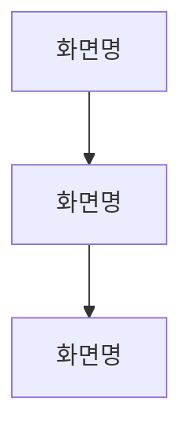

# Dou Product Design Workflow

Next.js + shadcn/ui 기반 Dou 제품 디자인 프로토타입 공통 워크플로우.

## 프로젝트 구조

작업 시작 전 CLAUDE.md의 `product_design_workflow` 키를 확인한다. 없으면 담당자에게 프로젝트 경로와 설정을 물어본다.

| 항목 | 값 |
|------|-----|
| 스택 | Next.js + Bun + React + TypeScript + shadcn/ui |
| 아이콘 | `@tabler/icons-react` (`Icon*` 형식) |
| shadcn 컴포넌트 | `components/ui/` (수정 금지) |
| 제품 전용 컴포넌트 | `components/[제품명]/` |
| 로컬 실행 | `bun run dev` → `http://localhost:3000` |
| UX 라이팅 스킬 | CLAUDE.md `product_design_workflow.ux_writing_skill` |
| 디자인 시스템 | **dou-design-system 단일 기준** (위치: CLAUDE.md `product_design_workflow.design_system`) |

## 디자인 시스템 단일 기준 (필수)

모든 Dou 제품은 **`dou-design-system` 하나**를 디자인 기준으로 쓴다. 제품별 DESIGN.md·토큰·컴포넌트 세트를 **따로 만들지 않는다** (기존 제품별 DESIGN.md는 이 중앙 기준으로 대체·폐지).

작업(설계·구현) 전 dou-design-system의 다음을 읽고 그대로 따른다:
- `DESIGN.md` — 철학(친절+신뢰)·색·타이포·컴포넌트 사용 규칙·Do/Don't
- `public/ai/design-system.md` — 컴포넌트 색인 + 사용법 + variant/size
- `public/ai/tokens.json` — 토큰 값(색·Pretendard·간격·radius)
- 사용법이 더 필요하면 `src/examples/<컴포넌트>.tsx`(공식 예제)를 참조

**위치**: CLAUDE.md `product_design_workflow.design_system`에 지정(레포 로컬 경로 또는 배포 URL, 추후 `@dou/ui` 패키지). 없으면 담당자에게 묻는다.

**규칙**:
- 색·radius·간격은 dou-design-system 토큰만 사용. 제품별 임의 토큰·색 금지.
- 컴포넌트는 dou-design-system 것을 재사용. 새로 만든 컴포넌트가 재사용 가치(2+ 화면/제품·범용·대체불가) 있으면 dou-design-system에 **승격 제안**(⑥ 참조).

## 서비스 IA 지도

작업 시작 전 `docs/ia.md`를 Read 도구로 읽어 서비스 전체 화면 흐름을 파악한다.

- **파일 없음** → 지금까지 구현된 화면을 기반으로 초기 `docs/ia.md` 생성을 담당자에게 제안한다
- **파일 있음** → 읽고 현재 화면이 전체 구조에서 어디에 위치하는지 파악한 뒤 작업 시작

`docs/ia.md` 형식:
```markdown
# [서비스명] IA


```

새 화면을 구현한 뒤 ⑨ 커밋 전에 `docs/ia.md` flowchart를 업데이트한다.

---

## 워크플로우

모든 화면 작업은 이 순서를 따른다. 구현부터 시작하지 않는다.

```
① 스펙 정의
② 화면 설계 제안
③ 와이어프레임 HTML 작성
④ UX 검토
⑤ 와이어프레임 컨펌
⑥ 구현
⑦ 타입 체크 → 오류 수정
⑧ 로컬 미리보기
⑨ 피드백 반영 → GitHub 커밋
```

### 작업 재개 시 — 현재 단계 파악 먼저

신규 화면이 아니라 이어서 진행하는 경우, **반드시 먼저** `docs/screens/[페이지명].md`를 Read 도구로 읽어 현재 단계를 확인한다.

| 문서 상태 | 재개 단계 |
|-----------|-----------|
| docs 파일 없음 | ① 부터 |
| 스펙 컨펌 ✓ / 화면 설계 컨펌 미체크 | ② |
| 화면 설계 컨펌 ✓ / 와이어프레임 컨펌 미체크 | ③ 또는 ④~⑤ |
| 와이어프레임 컨펌 ✓ / 구현 미완료 | ⑥ |
| 구현 완료 / 미리보기 미확인 | ⑧ |

확인 없이 ①부터 다시 시작하거나 임의로 단계를 건너뛰지 않는다.

---

## ① 스펙 정의

화면을 만들기 전에 "이 화면이 무엇을 해야 하는가"를 먼저 확정한다.
담당자와 대화로 아래 항목을 채운 뒤, 정리해서 컨펌을 받는다.

| 항목 | 내용 |
|------|------|
| **목적** | 이 화면이 해결하는 문제 |
| **사용자** | 누가, 어떤 상황에서 사용하는가 |
| **주요 기능** | 이 화면에서 할 수 있는 것 (우선순위 순) |
| **엣지 케이스** | 데이터 없음, 오류, 권한 없음 등 |
| **제약 조건** | 필수/선택 항목, 최대 개수, 권한 등 |
| **성공 기준** | "몇 탭 안에 ~를 할 수 있어야 한다" 형태로 |

확실하지 않은 항목은 담당자에게 반드시 물어본다. 스펙이 모호하면 설계가 흔들린다.

컨펌 형식: 위 표를 채운 뒤 `→ 이 스펙으로 설계 진행할까요?`로 마무리.

**컨펌 후 즉시:** `docs/screens/[페이지명].md` 파일을 생성하고 스펙 표와 진행 상황 체크리스트를 저장한다.
```markdown
# [화면명]

## 스펙
[스펙 표]

## 진행 상황
- [x] 스펙 컨펌
- [ ] 화면 설계 컨펌
- [ ] 와이어프레임 컨펌
- [ ] 구현
```

**이 생각이 들면 멈춰라:**

| 생각 | 현실 |
|------|------|
| "방향을 이미 말해줬으니 스펙 정의 생략 가능" | 방향 ≠ 스펙. 엣지 케이스·제약 조건은 별도 확인이 필요하다. |
| "간단한 화면이라 스펙 없이 해도 되겠지" | 간단해 보여도 요구사항이 다를 수 있다. 항상 확인해라. |
| "컨펌은 받았는데 docs는 나중에 써도 되겠지" | 지금 안 쓰면 잊는다. 컨펌 즉시 저장해라. |

---

## ② 화면 설계 제안

**스펙 컨펌 후 진행한다.**

**작업 시작 전 반드시 읽을 것 (dou-design-system 단일 기준):**
- dou-design-system `DESIGN.md` — 디자인 철학·색·타이포·컴포넌트 사용 규칙·Do/Don't
- dou-design-system `public/ai/design-system.md` — 컴포넌트 색인·사용법·variant/size
- dou-design-system `public/ai/tokens.json` — 토큰 값(색·Pretendard·간격·radius)
- (사용법 더 필요 시) dou-design-system `src/examples/<컴포넌트>.tsx` — 공식 예제

**REQUIRED SUB-SKILL:** UI 문구(버튼 라벨, 빈 상태 텍스트, 에러 메시지 등)가 포함될 때는 반드시 CLAUDE.md `product_design_workflow.ux_writing_skill`에 지정된 스킬을 Skill 도구로 invoke하여 작성한다.

**이 생각이 들면 멈춰라:**

| 생각 | 현실 |
|------|------|
| "버튼 라벨이 간단하니 ux-writing 스킬 생략해도 되겠지" | 간단한 문구일수록 톤·종결어미 실수가 난다. 항상 invoke해라. |
| "설계 방향만 잡는 거니 문구는 나중에 다듬으면 돼" | 나중에 고치면 와이어프레임까지 다시 작업해야 한다. 지금 해라. |

설계 제안은 구체적이어야 한다 — "카드를 쓴다"가 아니라 "CardHeader에 날짜, CardTitle에 사용자명, CardContent에 상세 정보를 배치한다"처럼. 레이아웃 구조, shadcn 컴포넌트 목록, 인터랙션 흐름, 빈 상태 처리, 모바일/데스크탑 차이를 설명한다.

**컨펌 후 즉시:** `docs/screens/[페이지명].md`에 화면 설계 내용을 추가하고 진행 상황을 업데이트한다.

---

## ③ 와이어프레임 HTML 작성

**저장 위치:** `public/wireframes/[페이지명].html`
→ `bun run dev` 실행 중이면 `localhost:3000/wireframes/[페이지명].html`에서 확인.

**REQUIRED:** 작성 전 Read 도구로 `~/.claude/skills/dou-product-design/wireframe-guide.md`를 읽는다. 제품에 별도 wireframe-guide가 있으면 그것도 함께 읽는다.

**CSS 규칙:** 와이어프레임 HTML은 **Tailwind CSS CDN + 유틸리티 클래스**로 작성한다. `<style>` 블록에 raw CSS를 작성하지 않는다. `@keyframes`와 `body { font-family }` 한 줄만 예외 허용.

**REQUIRED SUB-SKILL:** 와이어프레임 안의 모든 UI 문구(버튼 라벨, 빈 상태 텍스트, 배너 메시지, 안내 문구 등)는 반드시 지정된 ux-writing 스킬을 Skill 도구로 invoke하여 작성한다.

**핵심 규칙 (전체 상세는 wireframe-guide.md 참조):**
- **모든 화면 상태를 번호 섹션으로 나누고, 각 섹션은 모바일(좌) + 데스크탑(우) 세트로 배치**
- 실제 UI 문구 그대로 사용 (Lorem ipsum 금지)
- 고정 요소는 `※ 고정` 주석 표기

작성 후:
1. `localhost:3000/wireframes/[페이지명].html 에서 확인해 주세요` 전달
2. `docs/screens/[페이지명].md` 파일 상단(제목 바로 아래)에 와이어프레임 링크 추가:
   ```markdown
   **와이어프레임:** [localhost:3000/wireframes/{페이지명}.html](http://localhost:3000/wireframes/{페이지명}.html)
   ```

---

## ④ UX 검토

와이어프레임 작성 후 자동으로 수행한다. 별도 요청 없이 진행.

- **빈 상태** — 데이터 없을 때 처리됐는가
- **터치 영역** — 클릭/탭 가능한 요소가 최소 44px인가
- **정보 위계** — 중요한 정보가 먼저 보이는가
- **액션 명확성** — Primary 버튼이 화면당 1개인가
- **반응형** — 모바일/데스크탑 레이아웃이 모두 고려됐는가

이슈 없으면 "UX 검토 완료 — 이슈 없음" 명시. 이슈 있으면 와이어프레임 수정 후 전달.

---

## ⑤ 와이어프레임 컨펌

```
## 와이어프레임: [화면명]
파일: localhost:3000/wireframes/[페이지명].html

### UX 검토 결과
[이슈 목록 또는 "이슈 없음"]

→ 이 와이어프레임으로 구현 진행할까요?
```

**컨펌 전에는 절대 React 코드를 작성하지 않는다.**

> 이 컨펌은 **구조(LOCK)** 에 대한 합의다 — 화면 요소·그룹핑·정보 위계·플로우·상태. 간격·색·컴포넌트 선택 등 **시각(OPEN)** 은 ⑥에서 디자인 시스템으로 새로 정한다. (⑥의 LOCK/OPEN 계약 참조)

**이 생각이 들면 멈춰라:**

| 생각 | 현실 |
|------|------|
| "간단한 수정이라 바로 해도 되겠지" | 간단해 보여도 설계 의도가 다를 수 있다. 항상 물어봐라. |
| "방향을 이미 말해줬으니 와이어프레임 생략 가능" | 방향 ≠ 컨펌. 와이어프레임으로 눈으로 확인해야 한다. |
| "빠르게 만들어 보여주고 피드백 받으면 되지" | 구현 후 피드백은 수정 비용이 크다. 와이어프레임 먼저. |

---

## ⑥ 구현

컨펌 후 React 컴포넌트를 작성한다. **단, 와이어프레임을 픽셀로 베끼지 않는다.**

### 장치 1 — 와이어프레임 LOCK / OPEN 계약 (필수 인지)

와이어프레임이 **확정한 것(LOCK)** 과 **구현이 디자인 시스템으로 새로 정하는 것(OPEN)** 을 구분한다. 구현은 LOCK만 따르고, OPEN은 DS 기준으로 **재설계**한다.

| LOCK — 반드시 따름 | OPEN — 구현이 DS로 새로 결정 |
|---|---|
| 화면에 존재하는 요소 목록 | 정확한 간격·여백·정렬 |
| 요소 그룹핑 | 컴포넌트 선택 |
| 정보 위계(순서) | 색·타이포·radius·밀도·그림자 |
| 사용자 플로우 | 시각적 표현 전부 |
| 화면 상태(빈/에러/로딩) | |

> 와이어프레임은 그레이스케일 **구조 합의**일 뿐 시각 정답이 아니다. 박스 크기·간격·스타일을 그대로 옮기면 안 된다.

### 장치 2 — 컴포넌트 매핑 (React 작성 전 필수)

React를 쓰기 전에, 와이어프레임의 각 영역을 **어떤 DS 컴포넌트/패턴으로 매핑할지** 먼저 적는다. 구현의 출발점을 "와이어프레임"이 아니라 "DS 컴포넌트"로 바꾸는 차단막이다.

```
와이어프레임 상단 박스   → PageHeader
중간 반복 행            → ListItem (density: 웹 compact / 앱 comfortable)
하단 큰 버튼            → BottomActionBar + Button(default)
빈 화면                → EmptyView
```

매핑이 끝나면 **그 컴포넌트들의 기본 스타일·밀도 규칙으로 레이아웃을 새로 짠다** — 와이어프레임을 보고 그리지 않는다.

**컴포넌트 선택 우선순위:**

| 우선순위 | 방법 |
|---------|------|
| 1 | `components/ui/`(shadcn)·`components/dou/`(디자인 시스템 패턴)·`components/[제품명]/`에 있는 컴포넌트를 그대로 사용 |
| 2 | 없으면 디자인 느낌이 유사한 컴포넌트로 대체 |
| 3 | 대체 불가능하면 새 컴포넌트 만들어 등록 — 재사용 가치(2+ 화면/제품·범용·대체불가)가 있으면 **디자인 시스템 승격을 제안** |

**비주얼 디자인 방식:**
별도 Figma 디자인 없이 **dou-design-system의 컴포넌트·토큰**(`design-system.md`·`tokens.json`, 필요 시 `src/examples/*`) 기반으로 구현한다. 로컬 미리보기(⑧)에서 시각적 피드백을 받아 반영한다.

**규칙:**
- 모든 색상은 CSS 토큰 사용 (`bg-primary`, `text-muted-foreground` 등) — 하드코딩 금지
- 컴포넌트는 `components/ui/`의 shadcn 컴포넌트 우선
- **컴포넌트는 기본 스타일 그대로 사용한다 — `className`으로 임의 덮어쓰기 금지.** 스타일 변경이 필요하면 담당자에게 먼저 물어본다.
- 빈 상태 UI 반드시 구현
- 반응형 구현 — 모바일·데스크탑 모두

**디자인 인스펙터 자동 추가:**
제품이 `@dou/ui`를 사용(디자인 시스템 연동)한다면, 앱 루트 레이아웃에 `<DesignInspector />`를 한 번 추가한다(이미 있으면 생략). 모든 프로토타입 화면에서 "쓴 컴포넌트 + 상태 + 위치"를 디자이너가 바로 확인할 수 있게 하기 위함이다. 개발 환경에서만 노출한다.
```tsx
import { DesignInspector } from "@dou/ui"
// 루트 레이아웃(예: app/layout.tsx)에서, 개발 중에만:
{process.env.NODE_ENV === "development" && <DesignInspector catalogBaseUrl="<디자인시스템-사이트-URL>" />}
```
제품이 아직 `@dou/ui`를 연동하지 않았다면 생략한다(import 불가).

**REQUIRED SUB-SKILL:** 구현 중 `make-interfaces-feel-better` 스킬을 Skill 도구로 invoke하여 폴리시 원칙(border radius, animations, typography 등)을 적용한다.

**화면 간 통일성 — 반복 패턴 추출:**
구현 전, 이 화면에서 다른 화면에도 반복될 패턴이 있는지 먼저 파악한다. 반복될 패턴은 `components/[제품명]/` 하위에 공용 컴포넌트로 추출한다.

예: `PageHeader` (제목 + 우측 액션), `ListItem` (목록 행), `EmptyView` (빈 상태)

**구현 후 반드시 점검:**
구현이 끝나면 디자인 시스템 컴포넌트를 쓰지 않고 직접 만든 요소가 있는지 확인한다.
- 직접 만든 요소가 있으면 담당자에게 알린다
- 두 개 이상의 화면에서 반복될 것 같으면 `components/[제품명]/`에 등록할지 물어본다

**컴포넌트 위치 구분:**

| 종류 | 위치 | 예시 |
|------|------|------|
| shadcn 원자 컴포넌트 | `components/ui/` | `Button`, `Badge`, `Input` |
| 제품 범용 레이아웃 | `components/[제품명]/` | `PageHeader`, `EmptyView` |
| 제품 도메인 특화 | `components/[제품명]/` | 제품별 엔티티 카드/아이템 |

---

## ⑦ 타입 체크 → 오류 수정

```bash
bun run typecheck
```

오류가 있으면 담당자에게 전달하기 전에 모두 수정한다.

---

## ⑧ 로컬 미리보기

`localhost:3000/[페이지경로]` 에서 담당자가 직접 확인.

---

## ⑨ 피드백 반영 → README 업데이트 → GitHub 커밋

피드백 수정 후 타입 체크 → 재확인. 승인이 나오면:

**커밋 전 업데이트:**
1. `docs/ia.md` — 새 화면을 flowchart에 추가
2. `README.md` — 새 화면이나 주요 컴포넌트가 생겼다면 해당 섹션 업데이트

```bash
git add app/ components/ docs/ia.md README.md
git commit -m "feat: [화면명] 디자인 구현"
git push
```

---

## 자주 발생한 실수

| 실수 | 상황 | 올바른 대응 |
|------|------|-------------|
| 컴포넌트 기본 스타일 임의 덮어쓰기 | `Input`에 요청 없이 className 추가 | 기본 스타일 그대로 사용. 변경이 필요해 보이면 먼저 물어본다 |
| 컨펌 전 구현 | 와이어프레임 피드백 중인데 `page.tsx`가 이미 존재 | 구현 파일 삭제, docs 컨펌 항목 초기화 후 ③으로 복귀 |
| 재개 시 단계 오판 | "이어서 진행" 요청에 docs 확인 없이 임의 단계 시작 | `docs/screens/[페이지명].md` 읽어 현재 단계 확인 후 재개 |
| 와이어프레임 문구 ux-writing 미적용 | 버튼·배너 문구를 직접 작성 | 지정된 ux-writing 스킬 invoke 후 작성 |
| docs 파일 미생성 | 스펙·설계 컨펌 후 바로 다음 단계로 진행 | 컨펌 즉시 `docs/screens/[페이지명].md` 생성·업데이트 |
| README 업데이트 누락 | 구현 완료 후 커밋할 때 README 빠뜨림 | 커밋 전 `README.md` 구현된 화면·컴포넌트 섹션 업데이트 |
