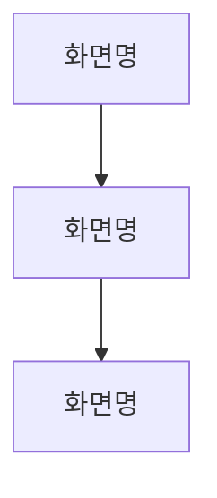

# Dou Product Design Workflow

Next.js + shadcn/ui 기반 Dou 제품 디자인 프로토타입 공통 워크플로우.

## ⓪ 정책 하네스 동기화 (모든 작업 전 필수)

설계·구현 어느 단계든 **작업을 시작하기 전에**, 이 프로젝트의 `docs/design-harness.md`를 Read 도구로 읽는다.

- **파일 있음** → 그 안의 소스 최신화 규칙(예: 기준 서비스 레포 `git pull --ff-only`)·정책 문서 참조·하네스 규칙을 그대로 따른다. pull이나 정책 읽기가 실패(로컬 변경·충돌·인증·네트워크)하면 낡은 소스로 작업하지 말고 중단·보고한다.
- **파일 없음** → 이 제품의 기준 소스 레포·정책 문서 위치를 담당자에게 물어 `docs/design-harness.md` 생성을 제안한다. 임의로 만들지 않는다.

> design-harness.md의 **내용(레포 경로·정책 위치)은 제품마다 다르며 각 제품 리포가 소유**한다. 이 스킬은 "각 프로젝트의 design-harness.md를 읽고 따른다"는 규칙만 강제한다. (제품 리포 `AGENTS.md`에도 같은 하네스 규칙이 자동 로드 컨텍스트로 실려 있을 수 있다.)

### 정책 게이트 (하네스가 연결된 제품에서 상시 적용)

동기화·통독은 정책을 **읽는** 데서 끝나지 않는다. 스펙·설계·와이어프레임·구현·수정 요청 전부에 대해, 담당자의 요청이 제품 정책(policies·issues·features·discussions 등)과 충돌하면 **그대로 실행하지 않는다.** 여기서 정책 충돌은 시각/레이아웃이 아니라 **제품 로직·도메인 규칙 차원**을 말한다.

충돌 시 순서:
1. 어떤 문서·정책과 왜 충돌하는지 **문서를 인용해 설명**한다.
2. 정책에 맞는 **대안을 제시**한다.
3. 담당자의 **확인을 받은 뒤** 진행한다.

- 예: "이 기능을 빼달라"는 요청이 정책상 필수 기능이면 빼지 말고 이유·대안을 제시. "이 유형 유저는 이렇게 동작하면 안 된다"는 정책이 있으면 그에 맞게 재설계 제안.
- 이 게이트는 "한 번 읽고 끝"이 아니라 세션 내내 유지되는 상시 제약이다. 애매하면 정책 허용 여부를 담당자에게 **먼저 되묻는다.**
- 시각/레이아웃 등 정책과 무관한 변경은 종전대로 자유롭게 반영한다.

## 프로젝트 구조

작업 시작 전 CLAUDE.md의 `product_design_workflow` 키를 확인한다. 없으면 담당자에게 프로젝트 경로와 설정을 물어본다.

| 항목 | 값 |
|------|-----|
| 스택 | Next.js + Bun + React + TypeScript + shadcn/ui |
| 아이콘 | `@tabler/icons-react` (`Icon*` 형식) |
| shadcn 컴포넌트 | `components/ui/` (수정 금지) |
| 제품 전용 컴포넌트 | `components/[제품명]/` |
| 로컬 실행 | `bun run dev` → `http://localhost:3000` |
| UX 라이팅 스킬 | CLAUDE.md `product_design_workflow.ux_writing_skill` |
| 디자인 시스템 | **dou-design-system 단일 기준** (위치: CLAUDE.md `product_design_workflow.design_system`) |

## 디자인 시스템 단일 기준 (필수)

모든 Dou 제품은 **`dou-design-system` 하나**를 디자인 기준으로 쓴다. 제품별 DESIGN.md·토큰·컴포넌트 세트를 **따로 만들지 않는다** (기존 제품별 DESIGN.md는 이 중앙 기준으로 대체·폐지).

작업(설계·구현) 전 dou-design-system의 다음을 읽고 그대로 따른다:
- `DESIGN.md` — 철학(친절+신뢰)·색·타이포·컴포넌트 사용 규칙·Do/Don't
- `public/ai/design-system.md` — 컴포넌트 색인 + 사용법 + variant/size
- `public/ai/tokens.json` — 토큰 값(색·Pretendard·간격·radius)
- 사용법이 더 필요하면 `src/examples/<컴포넌트>.tsx`(공식 예제)를 참조

**위치**: CLAUDE.md `product_design_workflow.design_system`에 지정(레포 로컬 경로 또는 배포 URL, 추후 `@dou/ui` 패키지). 없으면 담당자에게 묻는다.

**규칙**:
- 색·radius·간격은 dou-design-system 토큰만 사용. 제품별 임의 토큰·색 금지.
- 컴포넌트는 dou-design-system 것을 재사용. 새로 만든 컴포넌트가 재사용 가치(2+ 화면/제품·범용·대체불가) 있으면 dou-design-system에 **승격 제안**(⑥ 참조).

## 서비스 IA 지도

작업 시작 전 `docs/ia.md`를 Read 도구로 읽어 서비스 전체 화면 흐름을 파악한다.

- **파일 없음** → 지금까지 구현된 화면을 기반으로 초기 `docs/ia.md` 생성을 담당자에게 제안한다
- **파일 있음** → 읽고 현재 화면이 전체 구조에서 어디에 위치하는지 파악한 뒤 작업 시작

`docs/ia.md` 형식:
```markdown
# [서비스명] IA


```mermaid
flowchart TD
  A[화면명] --> B[화면명]
  B --> C[화면명]
```
```

새 화면을 구현한 뒤 ⑨ 커밋 전에 `docs/ia.md` flowchart를 업데이트한다.

---

## 워크플로우

모든 화면 작업은 이 순서를 따른다. 구현부터 시작하지 않는다.

```
⓪ 정책 하네스 동기화 (작업 시작 전 · 재개 시에도 먼저)
① 스펙 정의
② 화면 설계 제안
③ 와이어프레임 HTML 작성
④ UX 검토
⑤ 구조 컨펌 (와이어프레임/다이어그램)
⑥ 구현 (Path 1) 또는 핸드오프 패키지 작성 (Path 2 와이어프레임 / Path 3 다이어그램)
⑦ 타입 체크 → 오류 수정        (Path 1)
⑧ 로컬 미리보기                (Path 1)
⑨ 피드백 반영 → GitHub 커밋    (Path 1)
```

**⑥ 구현 — 세 갈래.** ①~⑤는 동일하다.
- **Path 1 — 디자이너가 직접 구현**: 아래 ⑥~⑨를 그대로 따른다.
- **Path 2 — 개발단 핸드오프 (와이어프레임 방식)**: ⑥ React 구현 대신 **"AI 구현 핸드오프 패키지"**(⑤ 뒤 별도 섹션)를 작성해 전달. 시각 자료 = 상세 와이어프레임(`wireframe.html`).
- **Path 3 — 개발단 핸드오프 (다이어그램 방식)**: 상세 와이어프레임이 과할 때. **개발 AI 입력** = 플로우/상태 다이어그램(`flow.md`) + README "화면 구성"(글, 낯선 화면만 블록). 여기에 **사람 감 잡기용 러프 스케치 `sketch.html`**(저해상도)을 곁들이되 **AI 입력이 아니라 사람만 본다**. **스펙·전달 등 나머지는 Path 2와 동일**(핸드오프 패키지 공유, 시각 자료만 다름).
- Path 2·3 공통: ⑦ 타입체크·⑧ 미리보기는 개발단이 수행. 방식은 프로젝트·시점마다 바뀔 수 있으므로 ⑥ 구현 단계 자체는 유지된다.

> **Path는 담당자의 의도로 정한다 — "Path 1/2/3" 용어를 요구하지 않는다.** "구현까지 해줘" → **Path 1**(직접 구현), "와이어프레임(으로) 핸드오프" / "와이어프레임까지만" → **Path 2**(와이어프레임 핸드오프), "다이어그램(으로) 핸드오프" / "다이어그램 수준으로 넘겨" → **Path 3**(다이어그램 핸드오프)로 **에이전트가 알아서 매핑**한다. 늘 한 방식인 프로젝트는 CLAUDE.md `product_design_workflow.implementation`(예: `handoff-diagram`)에 기본값을 둘 수 있고, 지시가 없으면 기본값을, 그것도 없으면 ⑤ 컨펌 때 확인한다.

### 작업 재개 시 — 현재 단계 파악 먼저

재개 시에도 ⓪ 정책 하네스 동기화를 먼저 수행한 뒤, **반드시** `docs/screens/[페이지명]/README.md`를 Read 도구로 읽어 현재 단계를 확인한다.

| 문서 상태 | 재개 단계 |
|-----------|-----------|
| docs 파일 없음 | ① 부터 |
| 스펙 컨펌 ✓ / 화면 설계 컨펌 미체크 | ② |
| 화면 설계 컨펌 ✓ / 구조 컨펌 미체크 | ③ 또는 ④~⑤ |
| 구조 컨펌 ✓ / 구현·핸드오프 미완료 | ⑥(Path 1) 또는 핸드오프(Path 2·3) |
| 구현 완료 / 미리보기 미확인 | ⑧ |

확인 없이 ①부터 다시 시작하거나 임의로 단계를 건너뛰지 않는다.

---

## ① 스펙 정의

화면을 만들기 전에 "이 화면이 무엇을 해야 하는가"를 먼저 확정한다.
담당자와 대화로 아래 항목을 채운 뒤, 정리해서 컨펌을 받는다.

| 항목 | 내용 |
|------|------|
| **목적** | 이 화면이 해결하는 문제 |
| **사용자** | 누가, 어떤 상황에서 사용하는가 |
| **주요 기능** | 이 화면에서 할 수 있는 것 (우선순위 순) |
| **엣지 케이스** | 데이터 없음, 오류, 권한 없음 등 |
| **제약 조건** | 필수/선택 항목, 최대 개수, 권한 등 |
| **성공 기준** | "몇 탭 안에 ~를 할 수 있어야 한다" 형태로 |

확실하지 않은 항목은 담당자에게 반드시 물어본다. 스펙이 모호하면 설계가 흔들린다.

컨펌 형식: 위 표를 채운 뒤 `→ 이 스펙으로 설계 진행할까요?`로 마무리.

**컨펌 후 즉시:** `docs/screens/[페이지명]/README.md` 파일을 생성하고 스펙 표와 진행 상황 체크리스트를 저장한다.
```markdown
# [화면명]

## 스펙
[스펙 표]

## 진행 상황
- [x] 스펙 컨펌
- [ ] 화면 설계 컨펌
- [ ] 구조 컨펌(와이어프레임/다이어그램)
- [ ] 구현 (Path 1) / 핸드오프 패키지 (Path 2·3)
```

**이 생각이 들면 멈춰라:**

| 생각 | 현실 |
|------|------|
| "방향을 이미 말해줬으니 스펙 정의 생략 가능" | 방향 ≠ 스펙. 엣지 케이스·제약 조건은 별도 확인이 필요하다. |
| "간단한 화면이라 스펙 없이 해도 되겠지" | 간단해 보여도 요구사항이 다를 수 있다. 항상 확인해라. |
| "컨펌은 받았는데 docs는 나중에 써도 되겠지" | 지금 안 쓰면 잊는다. 컨펌 즉시 저장해라. |

---

## ② 화면 설계 제안 (= UX 설계)

**스펙 컨펌 후 진행한다. ②는 UX 설계 — 디자이너가 소유하는 경험(LOCK)을 정한다:** 화면 요소·그룹핑·정보 위계, **플로우·상태·인터랙션(언제 무엇이 일어나나)·엣지/에러**. 컴포넌트 선택·간격·색 같은 **UI(시각·OPEN)는 여기서 정하지 않는다**(Path 1은 ⑥, Path 2·3은 개발팀이 DS로). **Path 3에선 이 UX 설계가 곧 산출물**(flow.md + 화면 구성)이라 특히 중요하다 — UI를 넘겨도 UX는 디자이너 몫.

**먼저 읽기:** dou-design-system `DESIGN.md`(디자인 철학·Do/Don't) — 어떤 결이어야 하는지 감을 잡는다. (컴포넌트 색인·토큰 `public/ai/*`은 시각을 정하는 ⑥/개발팀 단계에서 읽는다.)

**REQUIRED SUB-SKILL:** UI 문구(버튼 라벨, 빈 상태 텍스트, 에러 메시지 등)가 포함될 때는 반드시 CLAUDE.md `product_design_workflow.ux_writing_skill`에 지정된 스킬을 Skill 도구로 invoke하여 작성한다.

**이 생각이 들면 멈춰라:**

| 생각 | 현실 |
|------|------|
| "버튼 라벨이 간단하니 ux-writing 스킬 생략해도 되겠지" | 간단한 문구일수록 톤·종결어미 실수가 난다. 항상 invoke해라. |
| "설계 방향만 잡는 거니 문구는 나중에 다듬으면 돼" | 나중에 고치면 와이어프레임까지 다시 작업해야 한다. 지금 해라. |

설계 제안은 구체적이어야 한다 — 추상적으로 "목록을 보여준다"가 아니라 "상단에 날짜·환자명, 아래에 기록 행 반복, 각 행에 상태 배지, 하단에 기록 시작 버튼"처럼 **요소·배치·순서·상태**를 짚는다. 인터랙션 흐름, 빈/에러/로딩 상태, 제품 surface(모바일 전용/웹/둘 다)에 따른 레이아웃도 설명한다. **컴포넌트 이름·간격·색은 쓰지 않는다**(그건 ⑥/개발팀).

**컨펌 후 즉시:** `docs/screens/[페이지명]/README.md`에 화면 설계 내용을 추가하고 진행 상황을 업데이트한다.

---

## ③ 구조 시각화 — 와이어프레임(Path 1·2) / 다이어그램(Path 3)

**저장 위치:** `docs/screens/[페이지명]/wireframe.html` — 문서(README.md)와 **같은 폴더**에 둔다(화면별 한 폴더).
→ 확인: 그 HTML을 브라우저로 **바로 연다**(dev 서버 불필요; Tailwind CDN 쓰므로 인터넷만 있으면 됨).

> **Path 3(다이어그램 방식)이면** 와이어프레임 대신 (1) `docs/screens/[페이지명]/flow.md`(플로우/상태 다이어그램), (2) README "화면 구성"(각 화면 내부를 **글로**, 낯선 화면만 블록)을 만든다 — 이 둘이 **개발 AI가 읽는 핸드오프**. 추가로 (3) **의존성 없는 러프 스케치 `sketch.html`**(핵심 화면만 저해상도 박스, 파일만 열면 보이게)을 만들되 **이건 사람(디자이너·리뷰어) 전용 감 잡기용 — AI 핸드오프 입력이 아니다**(README "AI가 읽는 것" 목록·시각 자료에서 제외해, 스케치를 UI 스펙으로 오인하지 않게). **스케치는 저해상도 유지** — 디테일해지면 와이어프레임이 되니 금물(UI는 개발팀 소유). 두 방식은 공존 가능(한쪽을 지우지 않는다).

**Path 3 명확화 규칙 (시각 검증이 없으니 아래를 명시적으로 — 와이어프레임이 눈으로 잡아주던 것):**
- **전이에 '누가'를 표시** — 다이어그램 화살표가 **사용자 턴**인지 **시스템/AI 턴**인지 구분. 사용자 확인이 필요한 전이는 **질문 노드**로 그린다(자동 전이와 헷갈리지 않게). ← 실전에서 "자동으로 다음 단계"인지 "사용자가 눌러야"인지가 가장 자주 어긋난다.
- **다이어그램 ↔ 카피·동작 일치** — 전이(자동/게이트)가 확정 카피·동작규칙과 모순되지 않는지 확인(질문형 카피="게이트", 선언형="자동").
- **구조화된 내용은 표현 방식 명시** — diff·SOAP 등은 "무엇을 비교·강조하는지, 필드별인지"를 화면 구성 글에 적는다(그림이 없으니 글이 유일한 근거).
- **새 surface는 네비게이션 모델 명시** — 전체화면/바텀시트/모달·뒤로가기 동작. 시각이 아니라 **플로우**라 LOCK(동작규칙에).
- **반복·에러·빈 상태**도 분기·상태에 포함(loop-back, 저장 실패, 빈 대화 등).

> **산출물엔 결과(내용)만 — 작성 방법론은 넣지 않는다.** "뻔한 화면은 글, 낯선 화면만 블록", "(글)/(블록)" 같은 라벨은 *스킬이 어떻게 만들지*에 대한 규칙이지 개발팀이 볼 내용이 아니다. 이 스킬에만 두고, 핸드오프 문서·다이어그램에는 규칙을 적용한 **결과물**만 남긴다. (와이어프레임 방식도 동일.)

**REQUIRED:** 작성 전 Read 도구로 `~/.claude/skills/dou-product-design/wireframe-guide.md`를 읽는다. 제품에 별도 wireframe-guide가 있으면 그것도 함께 읽는다.

**CSS 규칙:** 와이어프레임 HTML은 **Tailwind CSS CDN + 유틸리티 클래스**로 작성한다. `<style>` 블록에 raw CSS를 작성하지 않는다. `@keyframes`와 `body { font-family }` 한 줄만 예외 허용.

**REQUIRED SUB-SKILL:** 와이어프레임 안의 모든 UI 문구(버튼 라벨, 빈 상태 텍스트, 배너 메시지, 안내 문구 등)는 반드시 지정된 ux-writing 스킬을 Skill 도구로 invoke하여 작성한다.

**핵심 규칙 (전체 상세는 wireframe-guide.md 참조):**
- **화면 상태를 번호로 나누되, 메인 플로우는 좌→우 가로 스트립(`→` 연결)·예외는 아래 세로. 프레임은 제품 surface에만(모바일 전용이면 모바일만)** — 상세 wireframe-guide.md
- 실제 UI 문구 그대로 사용 (Lorem ipsum 금지)
- 고정 요소는 `※ 고정` 주석 표기
- **와이어프레임은 순수 구조-합의용으로 유지** — 데이터·동작규칙·정책 등 구조 외 상세는 와이어프레임이 아니라 핸드오프 문서(⑤ 뒤 "AI 구현 핸드오프 패키지")에 담는다. UI/컴포넌트는 개발팀 소유라 핸드오프에도 넣지 않는다

작성 후:
1. `docs/screens/[페이지명]/wireframe.html 파일을 열어 확인해 주세요` 전달
2. `docs/screens/[페이지명]/README.md` 파일 상단(제목 바로 아래)에 와이어프레임 링크 추가:
   ```markdown
   **와이어프레임:** [`./wireframe.html`](./wireframe.html) — 같은 폴더. 파일로 바로 열기 또는 GitHub에서 열기.
   ```

---

## ④ UX 검토

와이어프레임/다이어그램 작성 후 자동으로 수행한다. 별도 요청 없이 진행. **두 렌즈로 본다.**

**A. UX·플로우 (경험 — 모든 Path. Path 3엔 이게 핵심이자 유일):**
- **상태 완결성** — 빈·로딩·에러·권한없음·성공 상태가 다 있는가
- **전이 명확성** — 모든 전이에 "누가"(사용자 턴/시스템 턴)가 분명한가, 자동 vs 사용자 확인(게이트)이 안 헷갈리는가
- **엣지·에러·되돌리기** — 실패·취소·재진입·loop-back·빈 입력이 처리됐는가
- **로직 일관성** — 다이어그램 ↔ 카피 ↔ 상태표가 서로 어긋나지 않는가
- **유저 저니** — 목표까지 흐름이 매끄럽고 군더더기 없는가(① 성공 기준 대비)

**B. UI·레이아웃 (화면을 그린 경우만 — Path 1/2 와이어프레임):**
- **터치 영역** — 탭 요소 최소 44px인가
- **정보 위계** — 중요한 정보가 먼저 보이는가
- **액션 명확성** — Primary 버튼이 화면당 1개인가
- **반응형** — 제품 surface에 맞는 레이아웃인가

> **UX 결함(전이·상태·로직)은 UI 체크로 안 잡힌다 — A를 먼저·반드시.** Path 3(다이어그램)은 UI를 안 그리므로 **A만** 본다(B는 개발팀 몫). Path 1/2는 A+B 모두.

이슈 없으면 "UX 검토 완료 — 이슈 없음" 명시. 이슈 있으면 수정 후 전달.

---

## ⑤ 구조 컨펌 (와이어프레임/다이어그램)

```
## 구조 컨펌: [화면명]
폴더: docs/screens/[페이지명]/ (README.md + 와이어프레임 또는 flow.md)

### UX 검토 결과
[이슈 목록 또는 "이슈 없음"]

→ 이 구조로 진행할까요? (Path 1 직접 구현 / Path 2 와이어프레임 핸드오프 / Path 3 다이어그램 핸드오프)
```

**컨펌 전에는 절대 React 코드를 작성하지 않는다.**

> 이 컨펌은 **구조(LOCK)** 에 대한 합의다 — 화면 요소·그룹핑·정보 위계·플로우·상태. 간격·색·컴포넌트 선택 등 **시각(OPEN)** 은 ⑥에서 디자인 시스템으로 새로 정한다. (⑥의 LOCK/OPEN 계약 참조)

**이 생각이 들면 멈춰라:**

| 생각 | 현실 |
|------|------|
| "간단한 수정이라 바로 해도 되겠지" | 간단해 보여도 설계 의도가 다를 수 있다. 항상 물어봐라. |
| "방향을 이미 말해줬으니 와이어프레임 생략 가능" | 방향 ≠ 컨펌. 와이어프레임으로 눈으로 확인해야 한다. |
| "빠르게 만들어 보여주고 피드백 받으면 되지" | 구현 후 피드백은 수정 비용이 크다. 와이어프레임 먼저. |

---

## AI 구현 핸드오프 패키지 (구현을 개발단 AI가 맡을 때 · ⑥ Path 2·3 공통)

구현 주체가 개발단 AI인 경우, ⑤ 컨펌 후 React 구현 대신 **핸드오프 패키지**를 작성해 전달한다. 핸드오프는 **디자이너가 검증할 수 있는 것(구조·플로우·상태·내용·정책·동작규칙 = LOCK)만** 담는다. **UI(컴포넌트 선택·간격·색·타이포·시각 = OPEN)는 개발팀이 프로젝트 DS로 구현·검증**하므로 핸드오프에 지정하지 않는다 — 디자이너가 못 보는 UI를 대신 스펙하지 않기 위함이다.

> ⑥ 구현 단계는 폐지되지 않는다. 디자이너가 직접 구현하면 ⑥, 개발단에 넘기면 이 핸드오프를 쓴다.

**저장 위치:** `docs/screens/[페이지명]/README.md` (스펙 문서를 핸드오프 스펙으로 확장). **시각 자료(와이어프레임/다이어그램)는 구조용으로 유지**하고, 아래 상세는 전부 이 README에 담는다.

**핸드오프에 담는 것 (LOCK — 디자이너가 검증 가능한 것만):**

| # | 항목 | 내용 |
|---|------|------|
| 1 | 목적·사용자·플로우 | 진입·이탈 경로 포함 |
| 2 | 시각 자료(AI가 읽음) | **Path 2 → 와이어프레임**(`wireframe.html`) · **Path 3 → 다이어그램**(`flow.md`) + 화면 구성 글. 최종 UI 아님. (Path 3의 `sketch.html`은 **사람 전용** — AI 입력 아님) |
| 3 | 화면 상태 + 트리거 | 각 상태가 언제 나타나는지(빈/에러/로딩/권한 등) |
| 4 | 콘텐츠/카피 | 실제 문구. ux-writing 스킬로 확정 |
| 5 | 데이터 모델 | 필드·타입·출처·빈 조건. 도메인 객체 분리(정책) |
| 6 | 동작 규칙 | 무엇을 하면 무엇이 되는지(예: 자동저장 금지). **컴포넌트·표현은 쓰지 않는다** |
| 7 | surface 제약 | 제품이 가진 surface에 맞춤(모바일 전용이면 데스크탑 불필요) |
| 8 | 정책 제약 | 이 화면에 바인딩되는 `docs/shared` 규칙 **인용**(경로+요지). 정책 게이트 연장 |
| 9 | 백엔드·신규 TBD | 설계가 요구하는 **없는 API·모델·엔드포인트를 "TBD(신규 필요)"로 명시** — 개발 AI가 있는 척 구현하지 않게 |
| 10 | precedent·재사용 | **이미 부분 구현된 게 있는지 먼저 조사**해 경로 명시 + 재사용할 기존 화면/컴포넌트 |
| 11 | 수용 기준 | 완성 판정 체크리스트(동작·정책 기준) |

**핸드오프에 담지 않는 것 (OPEN — 개발팀 소유):**

> 어떤 컴포넌트로 어떻게 그릴지 — 컴포넌트 선택·간격·색·타이포·시각 — 는 **개발팀이 프로젝트 DS로 구현·검증**한다. 디자이너는 UI를 지정·검증하지 않는다.
> - 핸드오프엔 **가드레일 한 줄만**: "프로젝트 DS(CLAUDE.md `product_design_workflow`)로 구현, 토큰 유틸만, 임의 오프-시스템 스타일 지양."
> - DS가 레지스트리형(shadcn MCP)이든 패키지형이든, DS 미완이라 필요한 컴포넌트가 없든 — 그 판단(대체·DS 승격 제안 포함)은 개발팀 몫.

**REQUIRED SUB-SKILL:** 핸드오프의 모든 UI 문구는 지정된 ux-writing 스킬을 Skill 도구로 invoke하여 확정한다.

**전달:** 핸드오프 **폴더 `docs/screens/[페이지명]/`**(README.md + 시각 자료 — Path 2 `wireframe.html` / Path 3 `flow.md`)를 **프로토타입 레포에 커밋·푸시**하고 폴더/README 링크를 공유한다 — GitHub에서 폴더를 열면 README가 자동 렌더되고 시각 자료가 옆에 있어 **함께 받는다.** (Path 3의 `sketch.html`은 사람 전용으로 폴더에 함께 있되 AI 입력 아님.)

---

## ⑥ 구현 (Path 1 — 디자이너가 직접 구현)

> Path 2·3(개발단 핸드오프)라면 이 섹션 대신 위 "AI 구현 핸드오프 패키지"를 따른다. 여기부터는 디자이너가 UI까지 직접 만드는 경우다.

컨펌 후 React 컴포넌트를 작성한다. **단, 와이어프레임을 픽셀로 베끼지 않는다.**

### 장치 1 — 와이어프레임 LOCK / OPEN 계약 (필수 인지)

와이어프레임이 **확정한 것(LOCK)** 과 **구현이 디자인 시스템으로 새로 정하는 것(OPEN)** 을 구분한다. 구현은 LOCK만 따르고, OPEN은 DS 기준으로 **재설계**한다.

| LOCK — 반드시 따름 | OPEN — 구현이 DS로 새로 결정 |
|---|---|
| 화면에 존재하는 요소 목록 | 정확한 간격·여백·정렬 |
| 요소 그룹핑 | 컴포넌트 선택 |
| 정보 위계(순서) | 색·타이포·radius·밀도·그림자 |
| 사용자 플로우 | 시각적 표현 전부 |
| 화면 상태(빈/에러/로딩) | |

> 와이어프레임은 그레이스케일 **구조 합의**일 뿐 시각 정답이 아니다. 박스 크기·간격·스타일을 그대로 옮기면 안 된다.

### 장치 2 — 컴포넌트 매핑 (React 작성 전 필수)

React를 쓰기 전에, 와이어프레임의 각 영역을 **어떤 DS 컴포넌트/패턴으로 매핑할지** 먼저 적는다. 구현의 출발점을 "와이어프레임"이 아니라 "DS 컴포넌트"로 바꾸는 차단막이다.

```
와이어프레임 상단 박스   → PageHeader
중간 반복 행            → ListItem (density: 웹 compact / 앱 comfortable)
하단 큰 버튼            → BottomActionBar + Button(default)
빈 화면                → EmptyView
```

매핑이 끝나면 **그 컴포넌트들의 기본 스타일·밀도 규칙으로 레이아웃을 새로 짠다** — 와이어프레임을 보고 그리지 않는다.

**컴포넌트 선택 우선순위:**

| 우선순위 | 방법 |
|---------|------|
| 1 | `components/ui/`(shadcn)·`components/dou/`(디자인 시스템 패턴)·`components/[제품명]/`에 있는 컴포넌트를 그대로 사용 |
| 2 | 없으면 디자인 느낌이 유사한 컴포넌트로 대체 |
| 3 | 대체 불가능하면 새 컴포넌트 만들어 등록 — 재사용 가치(2+ 화면/제품·범용·대체불가)가 있으면 **디자인 시스템 승격을 제안** |

**비주얼 디자인 방식:**
별도 Figma 디자인 없이 **dou-design-system의 컴포넌트·토큰**(`design-system.md`·`tokens.json`, 필요 시 `src/examples/*`) 기반으로 구현한다. 로컬 미리보기(⑧)에서 시각적 피드백을 받아 반영한다.

**규칙:**
- 모든 색상은 CSS 토큰 사용 (`bg-primary`, `text-muted-foreground` 등) — 하드코딩 금지
- 컴포넌트는 `components/ui/`의 shadcn 컴포넌트 우선
- **컴포넌트는 기본 스타일 그대로 사용한다 — `className`으로 임의 덮어쓰기 금지.** 스타일 변경이 필요하면 담당자에게 먼저 물어본다.
- 빈 상태 UI 반드시 구현
- 반응형 구현 — 제품 surface에 맞게(모바일 전용이면 모바일만)

**디자인 인스펙터 자동 추가:**
제품이 `@dou/ui`를 사용(디자인 시스템 연동)한다면, 앱 루트 레이아웃에 `<DesignInspector />`를 한 번 추가한다(이미 있으면 생략). 모든 프로토타입 화면에서 "쓴 컴포넌트 + 상태 + 위치"를 디자이너가 바로 확인할 수 있게 하기 위함이다. 개발 환경에서만 노출한다.
```tsx
import { DesignInspector } from "@dou/ui"
// 루트 레이아웃(예: app/layout.tsx)에서, 개발 중에만:
{process.env.NODE_ENV === "development" && <DesignInspector catalogBaseUrl="<디자인시스템-사이트-URL>" />}
```
제품이 아직 `@dou/ui`를 연동하지 않았다면 생략한다(import 불가).

**REQUIRED SUB-SKILL:** 구현 중 `make-interfaces-feel-better` 스킬을 Skill 도구로 invoke하여 폴리시 원칙(border radius, animations, typography 등)을 적용한다.

**화면 간 통일성 — 반복 패턴 추출:**
구현 전, 이 화면에서 다른 화면에도 반복될 패턴이 있는지 먼저 파악한다. 반복될 패턴은 `components/[제품명]/` 하위에 공용 컴포넌트로 추출한다.

예: `PageHeader` (제목 + 우측 액션), `ListItem` (목록 행), `EmptyView` (빈 상태)

**구현 후 반드시 점검:**
구현이 끝나면 디자인 시스템 컴포넌트를 쓰지 않고 직접 만든 요소가 있는지 확인한다.
- 직접 만든 요소가 있으면 담당자에게 알린다
- 두 개 이상의 화면에서 반복될 것 같으면 `components/[제품명]/`에 등록할지 물어본다

**컴포넌트 위치 구분:**

| 종류 | 위치 | 예시 |
|------|------|------|
| shadcn 원자 컴포넌트 | `components/ui/` | `Button`, `Badge`, `Input` |
| 제품 범용 레이아웃 | `components/[제품명]/` | `PageHeader`, `EmptyView` |
| 제품 도메인 특화 | `components/[제품명]/` | 제품별 엔티티 카드/아이템 |

---

## ⑦ 타입 체크 → 오류 수정

```bash
bun run typecheck
```

오류가 있으면 담당자에게 전달하기 전에 모두 수정한다.

---

## ⑧ 로컬 미리보기

`localhost:3000/[페이지경로]` 에서 담당자가 직접 확인.

---

## ⑨ 피드백 반영 → README 업데이트 → GitHub 커밋

> Path 1(직접 구현) 전용. Path 2·3은 구현물이 없으므로 커밋 대상이 핸드오프 폴더이며, "AI 구현 핸드오프 패키지 → 전달"을 따른다.

피드백 수정 후 타입 체크 → 재확인. 승인이 나오면:

**커밋 전 업데이트:**
1. `docs/ia.md` — 새 화면을 flowchart에 추가
2. `README.md` — 새 화면이나 주요 컴포넌트가 생겼다면 해당 섹션 업데이트

```bash
git add app/ components/ docs/ia.md README.md
git commit -m "feat: [화면명] 디자인 구현"
git push
```

---

## 자주 발생한 실수

| 실수 | 상황 | 올바른 대응 |
|------|------|-------------|
| 컴포넌트 기본 스타일 임의 덮어쓰기 | `Input`에 요청 없이 className 추가 | 기본 스타일 그대로 사용. 변경이 필요해 보이면 먼저 물어본다 |
| 컨펌 전 구현 | 와이어프레임 피드백 중인데 `page.tsx`가 이미 존재 | 구현 파일 삭제, docs 컨펌 항목 초기화 후 ③으로 복귀 |
| 재개 시 단계 오판 | "이어서 진행" 요청에 docs 확인 없이 임의 단계 시작 | `docs/screens/[페이지명]/README.md` 읽어 현재 단계 확인 후 재개 |
| 와이어프레임 문구 ux-writing 미적용 | 버튼·배너 문구를 직접 작성 | 지정된 ux-writing 스킬 invoke 후 작성 |
| docs 파일 미생성 | 스펙·설계 컨펌 후 바로 다음 단계로 진행 | 컨펌 즉시 `docs/screens/[페이지명]/README.md` 생성·업데이트 |
| README 업데이트 누락 | 구현 완료 후 커밋할 때 README 빠뜨림 | 커밋 전 `README.md` 구현된 화면·컴포넌트 섹션 업데이트 |
