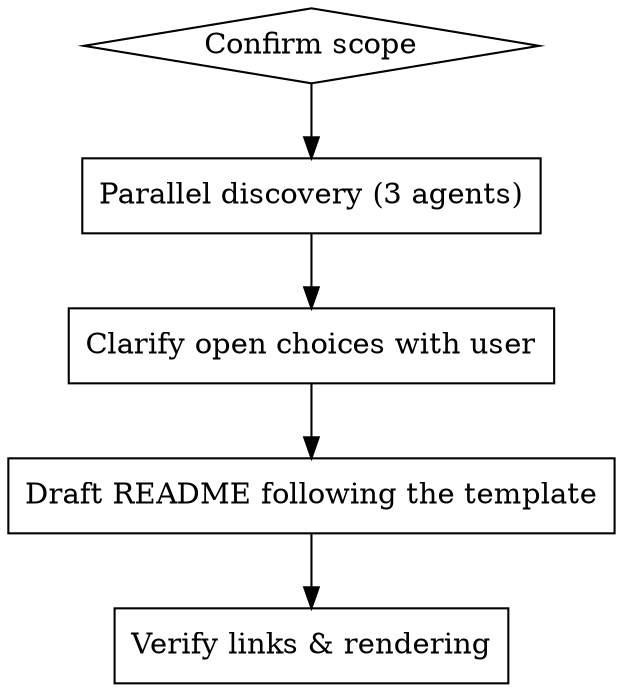
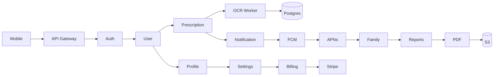
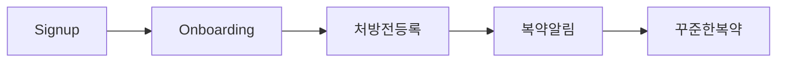
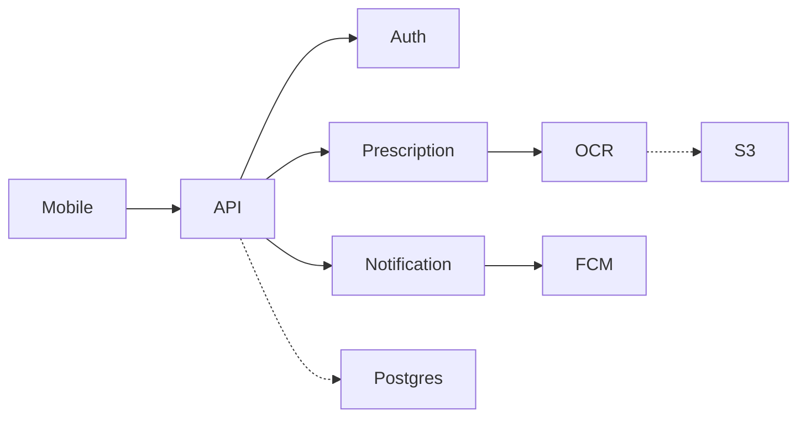

# Writing a Project README

## Overview

A great README answers four questions for **two audiences at once**:

1. _What is this?_ — non-engineers must understand in 30 seconds
2. _How do I use/install it?_ — engineers must get unblocked
3. _How does it fit together?_ — anyone evaluating must see architecture
4. _Where do I go next?_ — links to deeper docs, never duplicate them

This skill is **for full rewrites**, not for small edits. Activate only when the user explicitly asks for a comprehensive README.

## Invocation

This skill runs **only when the user explicitly invokes it** — e.g. `/writing-project-readme` or a clear request like "redo README.md based on the whole project". Do NOT auto-apply when:

- Editing a single section, fixing a link, or tweaking badges → use `Edit` directly
- Generating CHANGELOG, API reference, or ADRs → wrong artifact
- The existing README already covers the four audience questions → propose a tweak, not a rewrite

If you are reading this skill without an explicit invocation, stop and ask the user whether a full rewrite is intended.

## Core Principle

> **Top third is for non-engineers. Bottom two-thirds is for engineers. Setup details live in a separate file (`DEVELOPMENT.md`, `CONTRIBUTING.md`, etc.) — the README links to them, never copies them.**

If a non-engineer cannot read the first three sections and explain what the product does, the README has failed regardless of how complete the technical sections are.

## Workflow



### 1. Confirm scope

Before exploring, confirm:

- Does a setup/dev-environment doc already exist? (If yes, link to it. **Never** copy setup steps into the README.)
- Is the project public/open-source or internal? (Adjust tone, license, contact section.)
- Are there download/store links, badges, or visual identity to feature?

### 2. Parallel discovery (3 Explore subagents max)

Send a single message with **three Explore agents in parallel** covering:

| Agent                          | Scope                                                                                                                                               |
| ------------------------------ | --------------------------------------------------------------------------------------------------------------------------------------------------- |
| **Backend / server**           | Models, controllers, services, routes, commands, configs, jobs, external API integrations                                                           |
| **Frontend / client**          | Pages/screens, components, layouts, build config, design system, PWA/native shell                                                                   |
| **Business domain & identity** | App name/description/keywords from env or manifest, target user, store URLs, internal jargon, key migrations, dependency analysis to infer features |

Each agent should return **structured tables and lists, not prose**. Cap each section at 5–10 lines. Skip storytelling.

#### Prompt templates

Hand each Explore agent one of these verbatim — the format is part of the requirement.

**Backend / server agent:**

```text
Read this project and report the backend surface as compact tables. No prose.

Look in (whichever apply): app/, src/, server/, api/, routes/, jobs/, config/, migrations/, db/.

Report exactly these tables, 5–10 rows each:
1. Models — Name | Role | Key fields
2. Routes / endpoints — Method | Path | Handler | One-line purpose
3. Background jobs / queues — Name | Trigger | Purpose
4. External integrations — Service | Purpose | Where called
5. Datastore(s) — Engine | Used for

If a table has no entries, write "— none —".
```

**Frontend / client agent:**

```text
Read this project and report the frontend surface as compact tables. No prose.

Look in (whichever apply): apps/, web/, src/, app/, pages/, components/, layouts/, design-system/, public/, package.json, build config files.

Report exactly these tables, 5–10 rows each:
1. Entry points / routes — Path | Component | Purpose
2. Top-level layouts — Name | Where used
3. Design system / shared components — Name | Role
4. Build & tooling — Tool | Purpose (bundler, framework, CSS, testing)
5. Platforms shipped — Web / iOS / Android / Desktop / CLI | Status

If a table has no entries, write "— none —".
```

**Business domain & identity agent:**

```text
Read this project and report the product identity as compact tables. No prose.

Look in: README, package.json, manifest files (app.json, capacitor.config.*, Info.plist, AndroidManifest.xml), .env.example, docs/, marketing/, store-listing/.

Report exactly:
1. Product identity — Name | Tagline | Target user (one line each)
2. Distribution — Platform | Link or "internal" | Status
3. Core features inferred from code/deps — Feature | Evidence (file or dep)
4. Internal jargon / domain terms — Term | Definition
5. Compliance / standards mentioned — Standard | Where (filename or doc)

If a table has no entries, write "— none —".
```

### 3. Clarify open choices with the user

After discovery, ask **at most 3 questions** via the user-question tool. Default recommendations:

| Question                             | Recommended default                                                                   |
| ------------------------------------ | ------------------------------------------------------------------------------------- |
| Architecture diagram format          | Mermaid (renders on GitHub, scannable for non-engineers)                              |
| Tech-stack badges                    | Include 4–6 core badges (language, framework, key libraries)                          |
| Jargon level in feature descriptions | Non-engineer prose first, technology in parentheses: `처방약 자동 불러오기 (연동: …)` |

Avoid open-ended "any preferences?" prompts — present concrete options with previews.

### 4. Draft using the template (below)

Follow the section order strictly. The order itself does work — front-loading non-engineer content is the whole point.

### 5. Verify

- Every internal link resolves (relative paths exist)
- Mermaid blocks render in a GitHub preview
- Tables align under monospace; no broken pipes
- Zero emojis (unless the user explicitly requested them)
- Setup commands shown are **a 3–5 line teaser**, with a link to the full setup doc

## README Template

전체 템플릿은 [`template.md`](./template.md) 참고. 섹션 순서가 룰의 핵심이므로 임의 변경 금지 — 상단 1/3은 비개발자, 하단 2/3은 개발자.

## Adapting to Project Type

The template assumes a service app. Adjust before drafting:

| Project type               | Required sections                                                      | Skip / adapt                      |
| -------------------------- | ---------------------------------------------------------------------- | --------------------------------- |
| Service app (web/mobile)   | What / Who / Features / Architecture / Setup                           | —                                 |
| Library / SDK              | What / Install / Quick example / API summary                           | "User journey", "Platforms"       |
| CLI tool                   | What / Install / Commands / Examples                                   | Architecture diagram (보통 과함)  |
| Plugin / skill marketplace | What / 목록 테이블 / Install per item / Contributing                   | "User journey", ERD               |
| Monorepo                   | Top-level: What / Packages 표 / Architecture. 각 패키지는 자체 README. | 단일 Tech stack — 패키지별로 분산 |

This project (`agent-skills`) is the plugin / skill marketplace case — its [`README.md`](../../README.md) is a working reference layout.

## Writing Rules

- **No emojis** unless the user explicitly opts in.
- **No HTML** if Markdown alternatives exist. Tables > nested HTML divs.
- **Mermaid > ASCII > image** for diagrams. Mermaid renders on GitHub and stays diffable.
- **Tables for any 3+ parallel items.** Bullet lists become unscannable past 5 lines.
- **Code fences must specify a language** (`bash`, `text`, `mermaid`, `php`, `ts`, …) for syntax highlighting and lint compliance.
- **Blank lines around headings, lists, tables, fenced blocks.** Many Markdown linters flag missing ones.
- **Non-engineer phrasing first, jargon in parentheses.** Example: _Prescription auto-import (via insurance-claims API)_.
- **One verb per feature row.** Verbs reveal value; nouns hide it.
- **Don't restate setup.** Link to the dev guide. The README is the front door, not the manual.

## Language & Localization

| Audience         | Pattern                                                            |
| ---------------- | ------------------------------------------------------------------ |
| 국내 사용자 중심 | 한국어 우선, 영어 보조 (코드/명령어만 영어)                        |
| 글로벌 OSS       | 영어 단일                                                          |
| 한국 + 해외 동시 | 섹션 라벨 병기 — `설치 / Installation`, `목차 / Table of Contents` |

When writing Korean copy, follow the [`ux-writing-korean`](../ux-writing-korean/SKILL.md) skill. 핵심 규칙:

- 캐주얼 경어 (`-요`체), 능동형, 긍정형
- 명사 조합 회피 — `사용자 등록 처리` → `사용자를 등록해요`
- 이모지는 사용자가 명시적으로 요청했을 때만

This project's own [README.md](../../README.md) is a working example of the bilingual pattern.

## Concrete Examples

### Opening section

Bad — framework-first, no user value:

```markdown
# Awesome Project

A Laravel 11 application using Inertia.js, Tailwind CSS, and PostgreSQL.
```

Good — user value first, stack as supporting metadata:

```markdown
# Awesome Project

> **약을 깜빡해도 괜찮은 복약 관리 앱**
> 처방전을 사진 한 장으로 등록하면, 시간 맞춰 알려드려요.

PHP · Laravel · Inertia · PostgreSQL
```

### Feature list

Bad — prose buries the value:

```markdown
The application allows users to register, manage their medication schedules,
receive notifications, share with family members, and view adherence reports.
```

Good — table with verb-first rows, 한국어/영어 병기:

```markdown
| 기능             | 설명                                            |
| ---------------- | ----------------------------------------------- |
| 처방전 자동 등록 | 사진 한 장으로 약·복약 시간 입력 (OCR API 연동) |
| 복약 알림        | 시간대별 푸시 알림 + 잠금화면 위젯              |
| 가족 공유        | 보호자가 복약 여부를 실시간으로 확인            |
| 복약 리포트      | 주/월 단위 복용률, PDF 내보내기                 |
```

### Architecture diagram

Bad — single blob, 20+ nodes, unreadable:



Good — split into user journey + system, each ≤12 nodes:





## Common Mistakes

| Mistake                                                           | Fix                                                           |
| ----------------------------------------------------------------- | ------------------------------------------------------------- |
| Opening with "Installation" before the product is explained       | Move What/Who/Features above any setup                        |
| Burying app name behind technical framing ("A Laravel app for …") | Lead with what the user gets, not the framework               |
| Copying every dev-setup command into the README                   | Show 3–5 line teaser + link to the dedicated doc              |
| Dense paragraphs of feature descriptions                          | Convert to tables; one row per feature                        |
| Mermaid diagram with 20+ nodes                                    | Split into two diagrams (user journey vs. system) or simplify |
| Badges for every dependency                                       | Cap at 4–6 — only what defines the project                    |
| Single "Tech stack" list with 40 items                            | Group by layer in a table                                     |
| `**\`text\`\*\*` mixing bold + code unnecessarily                 | Pick one. Code for identifiers, bold for emphasis             |
| ASCII art trees in serif preview                                  | Use a fenced `text` block so it renders monospace             |
| Stale links to renamed files                                      | Re-verify every relative link after writing                   |

## Rationalization Table

Excuses you may catch yourself making, and the correct response:

| Excuse                                         | Reality                                                               |
| ---------------------------------------------- | --------------------------------------------------------------------- |
| "유저가 기술자라 jargon 써도 됨"               | 비개발자 한 명이라도 읽는다고 가정. 첫 세 섹션은 평이한 언어로.       |
| "셋업이 3줄이라 그냥 README에 넣자"            | 다음 사람이 또 복사함. 별도 파일이 없으면 새로 만들고, 있으면 링크만. |
| "이모지 하나만 — 분위기 살리기용"              | 사용자가 명시적으로 요청하지 않았으면 0개.                            |
| "다이어그램 노드가 20개여도 정확한 게 우선"    | 12개 넘으면 안 읽힘. 둘로 쪼개거나 단순화.                            |
| "기존 README가 짧으니 새로 쓰자"               | tweak 요청이면 풀 재작성 금지. When-Not-to-use 적용.                  |
| "프레임워크 이름이 곧 정체성"                  | 도구가 아닌 사용자 가치를 첫 문장에. 스택은 뱃지/Tech stack 섹션으로. |
| "한국어 README라 ux-writing-korean까지는 과함" | 톤이 어긋나면 가독성이 깨짐. 5분이면 핵심 규칙 확인 가능.             |

## Red Flags — STOP and Reconsider

- You are about to paste setup commands instead of linking → **Stop, link to dev doc.**
- You are writing your fifth paragraph before any heading → **Stop, convert to a table.**
- A non-engineer reading the first screen still can't say what the product does → **Stop, rewrite the top section.**
- Diagram has more than ~12 nodes → **Stop, split or simplify.**
- You added an emoji "for warmth" → **Stop, remove it unless the user asked.**

## When Not To Use This Skill

- Adding one badge or one section to an existing README → just edit
- Generating a CHANGELOG, RELEASE_NOTES, or API reference → different artifact
- Writing internal architecture decision records → use ADR conventions
- The project already has a good README and the user wants a tweak → don't rewrite

## Discovery Checklist Before Writing

- [ ] Confirmed full rewrite is wanted (not a tweak)
- [ ] Located existing dev/setup doc and confirmed it stays the source of truth
- [ ] Ran 3 parallel discovery agents (backend / frontend / domain)
- [ ] Identified target audiences (non-engineer roles included)
- [ ] Asked at most 3 clarifying questions with concrete options
- [ ] Confirmed badge set, diagram format, jargon level

## Verification After Writing

Run these once — all use `npx -y`, no permanent install:

```bash
# Markdown lint
npx -y markdownlint-cli README.md

# Relative-link resolution
npx -y markdown-link-check README.md

# Mermaid renders (writes rendered .md to /tmp; visually inspect or rely on GitHub preview)
npx -y @mermaid-js/mermaid-cli -i README.md -o /tmp/readme-rendered.md
```

Then walk the checklist:

- [ ] All relative links resolve
- [ ] Mermaid blocks render
- [ ] No emojis (unless requested)
- [ ] Setup section is a teaser + link, not a copy
- [ ] Non-engineer can summarize the product after reading the first three sections
- [ ] Engineer can locate architecture, structure, and commands without scrolling past unfamiliar prose
